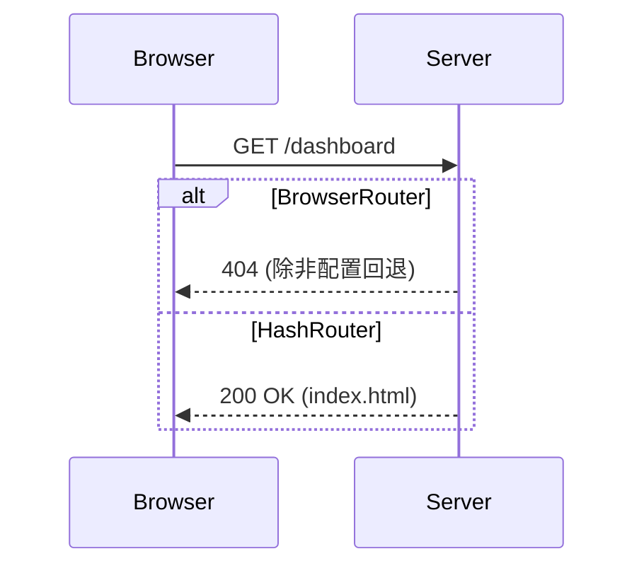

### React Router 的 BrowserRouter 与 HashRouter 深度解析

#### 一、底层实现原理对比

| 特性                | BrowserRouter                     | HashRouter                      |
|---------------------|-----------------------------------|---------------------------------|
| **URL 格式**        | `https://example.com/about`       | `https://example.com/#/about`   |
| **底层技术**        | HTML5 History API                | window.location.hash           |
| **核心 API**        | `pushState()`/`replaceState()`   | `onhashchange` 事件            |
| **页面刷新行为**    | 向服务器发送请求                  | 不发送请求（仅客户端路由）      |
| **SEO 友好性**      | ✅ 更好（标准路径）               | ❌ 较差（带 # 符号）            |
| **服务器要求**      | 需配置重定向到 index.html        | 无需特殊配置                   |
| **兼容性**          | IE10+                             | IE8+                           |

---

#### 二、技术实现细节

**1. BrowserRouter 核心机制：**
```javascript
// 伪代码实现
class BrowserRouter {
  constructor() {
    window.addEventListener('popstate', this.handlePopState);
  }

  push(path) {
    // 使用 History API 修改 URL
    window.history.pushState({}, '', path);
    this.updateView();
  }

  replace(path) {
    window.history.replaceState({}, '', path);
    this.updateView();
  }

  handlePopState = () => {
    this.updateView(); // 处理浏览器前进/后退
  }

  updateView() {
    const path = window.location.pathname;
    // 匹配对应组件并渲染
  }
}
```

**2. HashRouter 核心机制：**
```javascript
// 伪代码实现
class HashRouter {
  constructor() {
    window.addEventListener('hashchange', this.handleHashChange);
  }

  push(path) {
    // 修改 URL hash 部分
    window.location.hash = path;
  }

  replace(path) {
    window.location.replace(
      window.location.href.split('#')[0] + '#' + path
    );
  }

  handleHashChange = () => {
    const path = window.location.hash.substring(1); // 去掉 #
    // 匹配对应组件并渲染
  }
}
```

---

#### 三、关键差异详解

**1. 路由变化处理：**
- **BrowserRouter**：
  - 使用 `history.pushState()` 修改 URL 路径
  - 通过 `popstate` 事件监听浏览器前进/后退
  - URL 变化不会触发页面刷新

- **HashRouter**：
  - 修改 `window.location.hash`
  - 通过 `hashchange` 事件监听变化
  - URL 变化不会导致页面刷新

**2. 服务器交互：**


**3. 路径解析差异：**
```javascript
// BrowserRouter 的路径
https://app.com/user/profile

// HashRouter 的路径组成
https://app.com/#/user/profile
  └──┬──┘ └─┬──┘
   host   hash路由
```

---

#### 四、最佳实践场景

**✅ 使用 BrowserRouter 当：**
- 需要干净的 URL（对 SEO 友好）
- 使用现代浏览器（IE10+）
- 能配置服务器（如 Nginx/Apache）
- 示例配置：
  ```nginx
  # Nginx 配置
  location / {
    try_files $uri $uri/ /index.html;
  }
  ```

**✅ 使用 HashRouter 当：**
- 需要支持旧版浏览器（IE8/9）
- 静态站点托管（GitHub Pages 等）
- 无法控制服务器配置
- 快速原型开发

---

#### 五、进阶实现技巧

**1. 自定义 History 对象：**
```javascript
import { createBrowserHistory } from 'history';

const customHistory = createBrowserHistory({
  basename: '/app', // 基础路径
  forceRefresh: false // 是否强制刷新
});

<Router history={customHistory}>
```

**2. 滚动恢复方案：**
```javascript
// BrowserRouter 的滚动恢复
<BrowserRouter
  basename="/app"
  getUserConfirmation={() => {}}
  forceRefresh={false}
  keyLength={6}
>
  <ScrollRestoration />
</BrowserRouter>
```

**3. 路由状态管理：**
```javascript
// 获取路由历史堆栈
history.length

// 监听路由变化
history.listen((location, action) => {
  console.log(`路由变化: ${action} -> ${location.pathname}`);
});
```

---

#### 六、现代路由演进趋势

1. **嵌套路由布局**（React Router v6）：
   ```jsx
   <Routes>
     <Route path="/" element={<Layout />}>
       <Route index element={<Home />} />
       <Route path="dashboard" element={<Dashboard />} />
     </Route>
   </Routes>
   ```

2. **路由懒加载优化**：
   ```jsx
   const Dashboard = React.lazy(() => import('./Dashboard'));
   <Suspense fallback={<Spinner />}>
     <Route path="dashboard" element={<Dashboard />} />
   </Suspense>
   ```

3. **数据加载集成**：
   ```jsx
   // React Router v6.4+
   <Route
     path="/user/:id"
     loader={({ params }) => fetchUser(params.id)}
     element={<UserProfile />}
   />
   ```

选择 BrowserRouter 还是 HashRouter 取决于项目需求，现代应用推荐优先使用 BrowserRouter，它能提供更专业的用户体验和更好的 SEO 支持。
