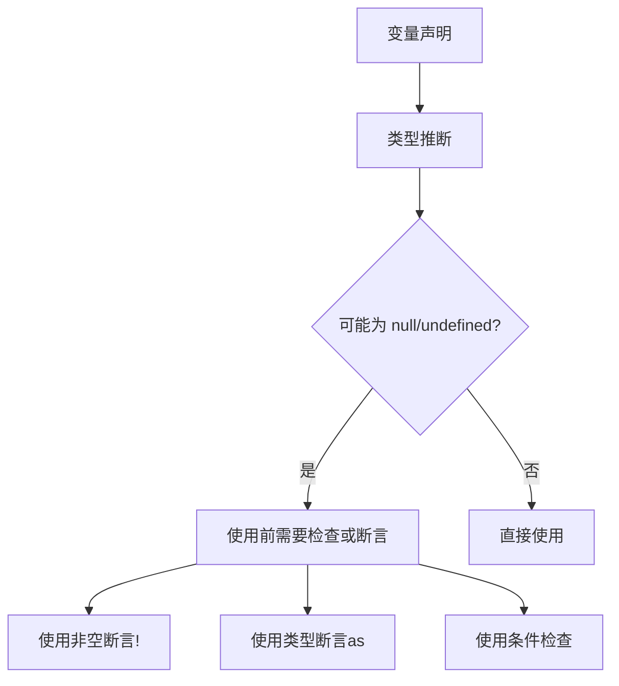

# TypeScript 中的非空断言操作符 (`!`) 详解

在 TypeScript 中，`!` 符号被称为**非空断言操作符**（Non-null Assertion Operator）。它告诉 TypeScript 编译器：**"这个值一定不是 null 或 undefined"**，从而跳过类型检查。让我们深入分析您提到的代码和这个操作符的原理。

## 一、代码分析

您提到的代码：
```typescript
ReactDom.createRoot(loading!).render();
```
其中：
- `loading` 是一个变量
- `!` 是 TypeScript 的非空断言操作符

## 二、非空断言操作符 (`!`) 详解

### 1. 为什么需要非空断言？

在 TypeScript 的严格模式下，当你尝试使用可能为 `null` 或 `undefined` 的值时，编译器会抛出错误：

```typescript
const loading = document.getElementById('loading');

// ❌ TypeScript 报错：
// Argument of type 'HTMLElement | null' is not assignable to parameter of type 'Element'.
ReactDOM.createRoot(loading).render(<Loading />);
```

### 2. `!` 操作符的作用

通过在变量后添加 `!` 操作符：
```typescript
ReactDOM.createRoot(loading!).render(<Loading />);
```

这相当于告诉 TypeScript：
> "我知道 `loading` 有可能为 null，但我**100%确定**在这种情况下它不会为 null，所以请让我通过编译"

## 三、不同解决方案对比

| **处理方式** | **特点** | **适用场景** | **代码示例** |
|--------------|---------|-------------|-------------|
| **非空断言 (`!`)** | 简洁但有风险 | 你绝对确定该值存在 | `element!.doSomething()` |
| **类型断言 (`as`)** | 显式强制类型转换 | 需要改变类型 | `element as HTMLElement` |
| **空值检查 (if)** | 最安全 | 不确定值是否存在时 | `if(element) {...}` |
| **空值合并 (`??`)** | 提供默认值 | 替代值为 null/undefined 的情况 | `element ?? defaultElement` |

## 四、底层原理分析

### TypeScript 类型系统处理流程：


### `document.getElementById()` 的官方类型定义：
```typescript
interface Document {
    getElementById(elementId: string): HTMLElement | null;
}
```

## 五、安全使用非空断言的场景

### 1. 安全的用例（确定元素存在）
```html
<!-- index.html -->
<div id="loading"></div>
```

```typescript
// 在React入口文件中
const loading = document.getElementById('loading');

// ✅ 安全：因为HTML中已经声明了这个元素
ReactDOM.createRoot(loading!).render(<Loading />);
```

### 2. 有风险的用法（可能运行时出错）
```typescript
function mountComponent(elementId: string) {
    const element = document.getElementById(elementId);

    // ❌ 危险：可能为null
    ReactDOM.createRoot(element!).render(<Component />);
}

mountComponent('maybe-not-exist'); // 运行时错误！
```

## 六、更安全的替代方案

### 1. 使用条件检查（推荐）
```typescript
const loading = document.getElementById('loading');

if (loading) {
    const root = ReactDOM.createRoot(loading);
    root.render(<Loading />);
} else {
    console.error('Loading container not found!');
}
```

### 2. 自定义类型安全的挂载函数
```typescript
function safeRender(containerId: string, component: React.ReactElement) {
    const container = document.getElementById(containerId);

    if (!container) {
        throw new Error(`Container ${containerId} not found`);
    }

    const root = ReactDOM.createRoot(container);
    root.render(component);
    return root;
}

// 使用
safeRender('loading', <Loading />);
```

### 3. 使用 HTML 模板验证（Preact 启发）
```typescript
function createContainer(id: string) {
    let container = document.getElementById(id);

    if (!container) {
        container = document.createElement('div');
        container.id = id;
        document.body.appendChild(container);
    }

    return container;
}

const loadingRoot = ReactDOM.createRoot(createContainer('loading'));
loadingRoot.render(<Loading />);
```

## 七、为什么在 React 项目中常见的应用场景

在 React 项目中，我们通常会在以下场景看到 `!` 操作符：

1. **入口文件**：主 `<div id="root">` 一定存在
2. **资源加载器**：提前创建好的加载容器
3. **浏览器扩展**：注入到特定容器
4. **微前端应用**：挂载到宿主应用的容器

## 八、专家级实践建议

### 1. 使用 VS Code 的注释指令
```typescript
// eslint-disable-next-line @typescript-eslint/no-non-null-assertion
const element = document.getElementById('container')!;
```

### 2. 配置 TypeScript 规则
```json
{
    "compilerOptions": {
        "strictNullChecks": true,
    },
    "rules": {
        "@typescript-eslint/no-non-null-assertion": "warn"
    }
}
```

### 3. 防御式代码模式
```typescript
function getRequiredElement(id: string): HTMLElement {
    const element = document.getElementById(id);
    if (!element) throw new Error(`Element ${id} not found`);
    return element;
}

// 安全使用
ReactDOM.createRoot(getRequiredElement('root')).render(<App />);
```

## 九、项目架构启示

| **方案** | **类型安全** | **简洁性** | **性能** | **维护性** |
|----------|-------------|-----------|---------|-----------|
| 非空断言 (!) | ⭐ | ⭐⭐⭐⭐⭐ | ⭐⭐⭐⭐⭐ | ⭐⭐ |
| 类型转换 (as) | ⭐⭐ | ⭐⭐⭐⭐ | ⭐⭐⭐⭐⭐ | ⭐⭐⭐ |
| 条件检查 (if) | ⭐⭐⭐⭐⭐ | ⭐⭐⭐ | ⭐⭐⭐⭐ | ⭐⭐⭐⭐⭐ |
| 工厂函数 | ⭐⭐⭐⭐⭐ | ⭐⭐⭐ | ⭐⭐⭐⭐ | ⭐⭐⭐⭐⭐ |

## 总结

1. **`!` 是非空断言操作符**：告诉 TypeScript 该值不为 null/undefined
2. **合理使用场景**：当开发者 100% 确认元素存在时
3. **潜在风险**：可能导致运行时错误
4. **最佳实践**：
   - 在入口文件中使用是可接受的
   - 动态容器应使用条件检查
   - 创建工厂函数是最安全的方案

在您的项目中使用：
```typescript
// 主入口文件 main.tsx - 安全使用!
const root = ReactDOM.createRoot(
    document.getElementById('root')!
);
root.render(<App />);

// 加载容器 - 有条件的做法
const loading = document.getElementById('loading');
if (loading) {
    ReactDOM.createRoot(loading).render(<Loading />);
}
```

记住：非空断言 (`!`) 是开发者对编译器的承诺，承诺"此处非空"的责任完全在你。滥用这个操作符可能会使 TypeScript 类型安全的优势化为乌有，应该谨慎使用。
